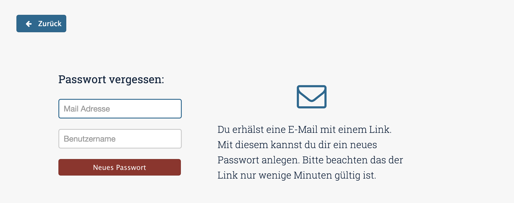

# Die Liebsten

This used to be my first real web app. It was the moment I got into Node.js programming. Out of sentimentality I'm keeping the repo online.

## Main Features

 
## Login and register forms

 
## Change user specific information
+ change mail
+ change password
+ delete account
+ get support mail

 
## Forgot password
+ sends reactivation link to enter new password

 
## Dashboard view
+ view news from other users
+ manage own lists
	+ create
	+ reorder
	+ delete

 
## Public view of lists

